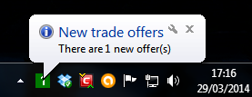
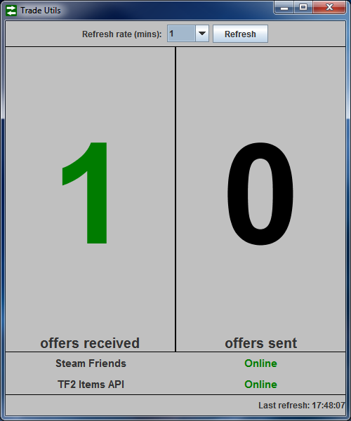

Steam TradeUtils
================

A small Java program to notify you of new trade offers. The data is provided by the [Steam Web API](https://developer.valvesoftware.com/wiki/Steam_Web_API/IEconService). Thus, an [API key](http://steamcommunity.com/dev/apikey) is required.

TradeUtils also checks [Steam Gauges](http://steamgaug.es/) so you can easily tell if the TF2 item API is down. This status is reflected by the tray icon color.

**Key saved in `config.cfg`. Delete this file to force TradeUtils to reprompt for the key.**

